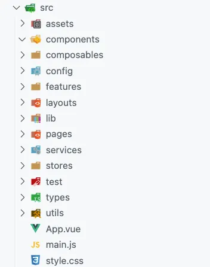

# boilerplate

### Vue.js boilerplate with some features and configs like:

- 🎉 TypeScript
- ✏️ ESLint
- 🛠 Prettier
- 🦊 Husky
- 🚫 lint-staged
- 🚨 Commitlint

### TypeScript Check

Type-check TypeScript files:

```bash
npm run type-check
```

### Lint with [ESLint](https://eslint.org/)

```bash
npm run lint
```

### Format with [Prettier](https://prettier.io/)

```bash
npm run format
```

### Add commits with [Commitlint](https://commitlint.js.org/)

```bash
npm run commit
```

## Folder Structure

Image from [fadamakis.com](https://fadamakis.com/a-front-end-application-folder-structure-that-makes-sense-ecc0b690968b)


